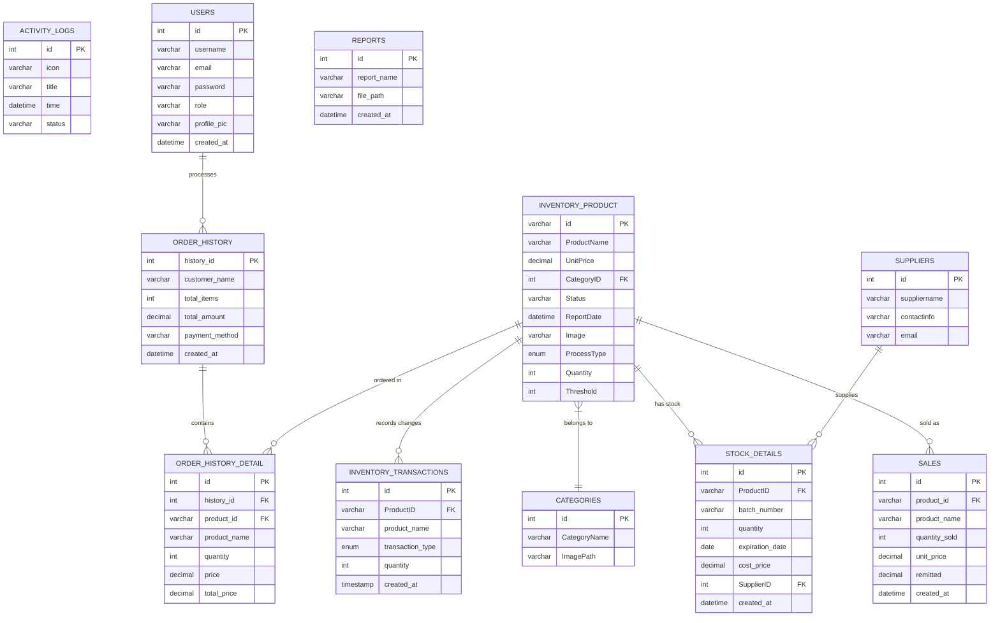

```mermaid
erDiagram
    INVENTORY_PRODUCT {
        varchar id PK
        varchar ProductName
        decimal UnitPrice
        int CategoryID FK
        varchar Status
        datetime ReportDate
        varchar Image
        enum ProcessType
        int Quantity
        int Threshold
    }
    
    CATEGORIES {
        int id PK
        varchar CategoryName
        varchar ImagePath
    }
    
    SUPPLIERS {
        int id PK
        varchar suppliername
        varchar contactinfo
        varchar email
    }
    
    STOCK_DETAILS {
        int id PK
        varchar ProductID FK
        varchar batch_number
        int quantity
        date expiration_date
        decimal cost_price
        int SupplierID FK
        datetime created_at
    }
    
    INVENTORY_TRANSACTIONS {
        int id PK
        varchar ProductID FK
        varchar product_name
        enum transaction_type
        int quantity
        timestamp created_at
    }
    
    ACTIVITY_LOGS {
        int id PK
        varchar icon
        varchar title
        datetime time
        varchar status
    }
    
    SALES {
        int id PK
        varchar product_id FK
        varchar product_name
        int quantity_sold
        decimal unit_price
        decimal remitted
        datetime created_at
    }
    
    ORDER_HISTORY {
        int history_id PK
        varchar customer_name
        int total_items
        decimal total_amount
        varchar payment_method
        datetime created_at
    }
    
    ORDER_HISTORY_DETAIL {
        int id PK
        int history_id FK
        varchar product_id FK
        varchar product_name
        int quantity
        decimal price
        decimal total_price
    }
    
    USERS {
        int id PK
        varchar username
        varchar email
        varchar password
        varchar role
        varchar profile_pic
        datetime created_at
    }
    
    REPORTS {
        int id PK
        varchar report_name
        varchar file_path
        datetime created_at
    }
    
    INVENTORY_PRODUCT ||--o{ INVENTORY_TRANSACTIONS : "records changes"
    INVENTORY_PRODUCT }|--|| CATEGORIES : "belongs to"
    INVENTORY_PRODUCT ||--o{ STOCK_DETAILS : "has stock"
    SUPPLIERS ||--o{ STOCK_DETAILS : "supplies"
    ORDER_HISTORY ||--o{ ORDER_HISTORY_DETAIL : "contains"
    INVENTORY_PRODUCT ||--o{ ORDER_HISTORY_DETAIL : "ordered in"
    INVENTORY_PRODUCT ||--o{ SALES : "sold as"
    USERS ||--o{ ORDER_HISTORY : "processes"
``` 