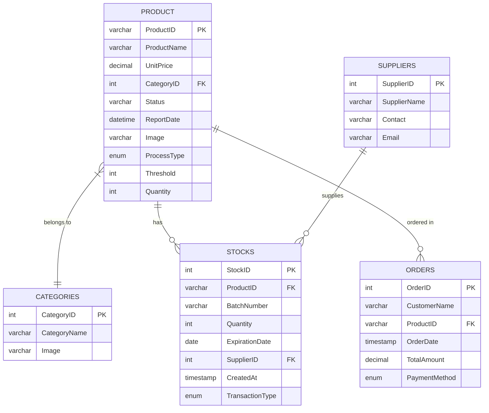

```mermaid
erDiagram
    PRODUCT {
        varchar ProductID PK
        varchar ProductName
        decimal UnitPrice
        int CategoryID FK
        varchar Status
        datetime ReportDate
        varchar Image
        enum ProcessType
        int Threshold
        int Quantity
    }
    
    STOCKS {
        int StockID PK
        varchar ProductID FK
        varchar BatchNumber
        int Quantity
        date ExpirationDate
        int SupplierID FK
        timestamp CreatedAt
        enum TransactionType
    }
    
    SUPPLIERS {
        int SupplierID PK
        varchar SupplierName
        varchar Contact
        varchar Email
    }
    
    CATEGORIES {
        int CategoryID PK
        varchar CategoryName
        varchar Image
    }
    
    ORDERS {
        int OrderID PK
        varchar CustomerName
        varchar ProductID FK
        timestamp OrderDate
        decimal TotalAmount
        enum PaymentMethod
    }
    
    PRODUCT }|--|| CATEGORIES : "belongs to"
    PRODUCT ||--o{ STOCKS : "has"
    SUPPLIERS ||--o{ STOCKS : "supplies"
    PRODUCT ||--o{ ORDERS : "ordered in"
``` 